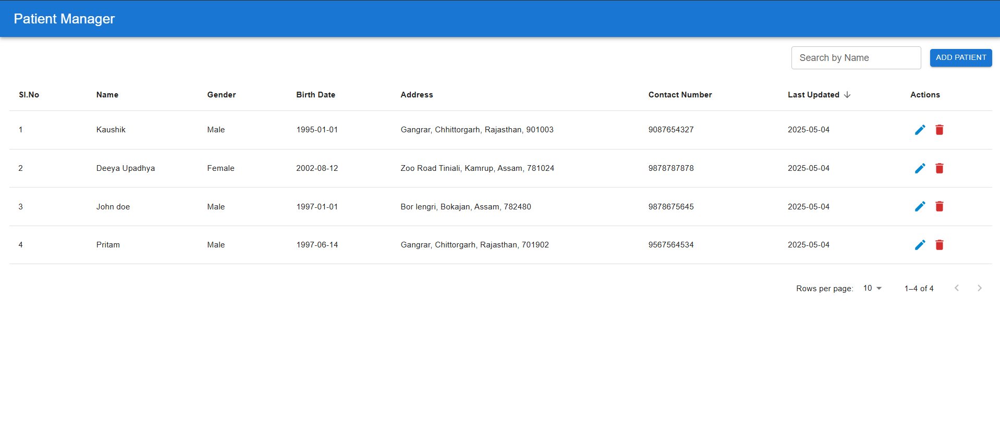
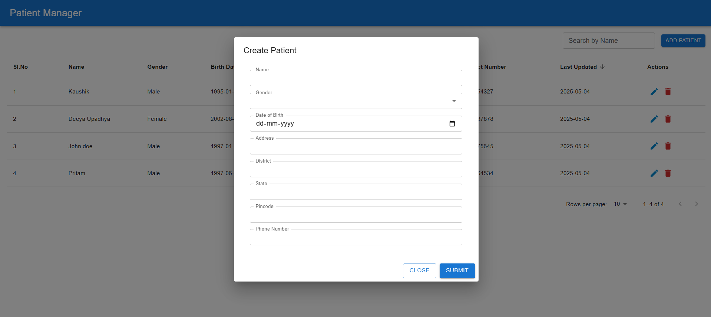
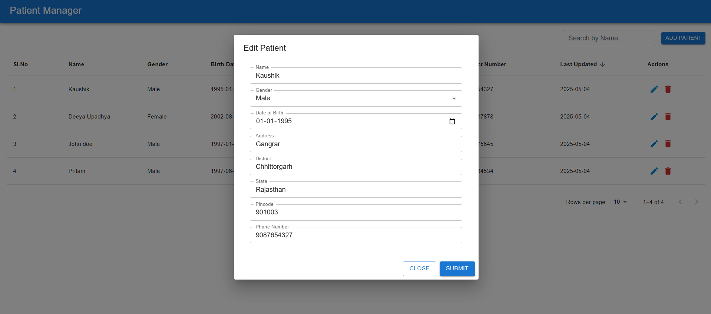
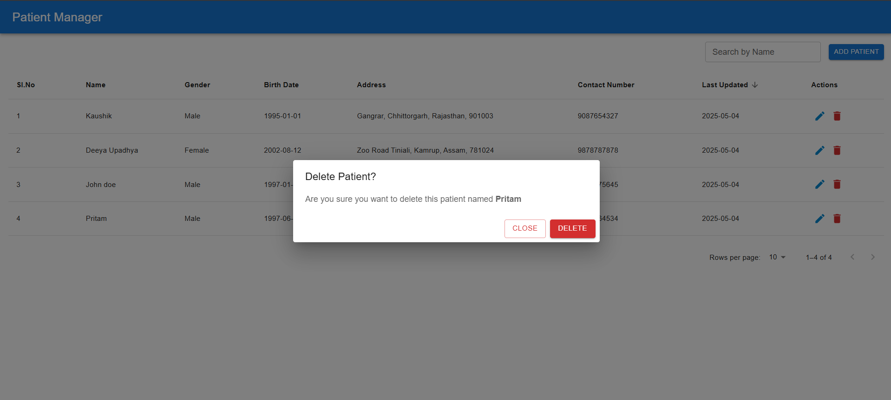

# Building a Patient Manager: Lessons in React, FHIR, and Docker

When I set out to build a simple CRUD app for managing patient data, I didn't think I'd end up deep in the world of healthcare standards, Docker quirks, and JSON structures that look like a complicated maze. But here I am, and it's safe to say I learned a lot along the way.

Let me walk you through what I built, how I built it, and what I learned in the process.

---

## The Idea: A Simple App with Complex Standards

The goal sounded straightforward enough:  
**Build a frontend in React to manage patients : create, read, update, delete.** The twist? All of this had to work with a **FHIR-compliant server**, running inside Docker.

To give you an introduction, **FHIR (Fast Healthcare Interoperability Resources)** is the international standard for healthcare data. It’s supposed to be the backbone of how modern medical apps talk to each other.

This is a preview of the Patient Manager Dashboard that I have built.

  
 _Home Page with the patient list_.

---

## The Stack

I opted for a familiar and focused tech stack:

- **React** for the frontend
- **Docker** to containerize and run our project
- **HAPI FHIR Server** to serve as the backend FHIR-compliant API
- FHIR **Patient** resource as our core data model

Spoiler: I thought JSON was simple until I met FHIR.

---

## Running It All Locally

Let us start with _how_ to run the project locally. I have ensured to make this project as simple as possible to set up and run locally.

### 1. Cloning the Project

```bash
git clone https://github.com/PritamU/fhir_patients

cd fhir_patients
```

### 2. Install Dependencies

```bash
npm install
```

### 3. Run the Project

We used Docker Compose for this. Just run:

```bash
docker-compose up
```

This spins up the HAPI FHIR server on port `8080`. You can visit [http://localhost:8080/fhir](http://localhost:8080/fhir) to make sure it’s running.

And it also starts the react app on port `3000`. You can visit [https://localhost:3000](https://localhost:3000) to open the web application.

NOTE : _This command might take a while so I'll recommend to keep checking the logs if both the frontend (React) and the backend (FIHR Server) are installed and active._

---

## What the App Does (and How)

Once it's running, you can:

1. **Add** new patients by filling out a form : name, date of birth, gender, address details and phone number.

  
 _A modal form to add a new patient to the FHIR server._

An example of the payload sent from this request is shown below:

```json
{
  "resourceType": "Patient",
  "name": [{ "use": "official", "text": "Pritam" }],
  "gender": "male",
  "birthDate": "1997-06-14",
  "address": [
    {
      "text": "Hengrabari",
      "district": "Kamrup Metro",
      "state": "Assam",
      "postalCode": "789678"
    }
  ],
  "telecom": [{ "system": "phone", "value": "9856656565" }]
}
```

As you can see, the FHIR JSON structure is very verbose and does not translate well
to a normal form sequence, however I managed to simplify it to the best of my capablilites.

2. **View** all patients stored on the backend, search the patients by their name and sort them based on their name, date of birth, last Updated, etc.

  
_A clean dashboard showing a list of all patients stored in the FHIR backend._

An example of the payload received from this request is shown below :

```json
{
  "resourceType": "Bundle",
  "id": "2a6bfaa9-c240-43dd-b8a0-4df5967e920b",
  "meta": {
    "lastUpdated": "2025-05-04T13:21:03.300+00:00"
  },
  "type": "searchset",
  "total": 2,
  "link": [
    {
      "relation": "self",
      "url": "http://localhost:8080/fhir/Patient?_count=10&_getpagesoffset=0&_sort=-_lastUpdated"
    }
  ],
  "entry": [
    {
      "fullUrl": "http://localhost:8080/fhir/Patient/3",
      "resource": {
        "resourceType": "Patient",
        "id": "3",
        "meta": {
          "versionId": "1",
          "lastUpdated": "2025-05-04T13:02:42.518+00:00",
          "source": "#foXvnxc2P96qpXKw"
        },
        "name": [
          {
            "use": "official",
            "text": "Deeya Upadhya"
          }
        ],
        "telecom": [
          {
            "system": "phone",
            "value": "9879879878"
          }
        ],
        "gender": "female",
        "birthDate": "2002-10-12",
        "address": [
          {
            "text": "hengrabari",
            "district": "kamrup",
            "state": "assam",
            "postalCode": "899899"
          }
        ]
      },
      "search": {
        "mode": "match"
      }
    }
  ]
}
```

3. **Edit** existing records when a patient’s details change or need correction.

  
_Easily update existing patient info using the edit modal._

An example of the payload sent in this request is shown below:

```json
{
  "resourceType": "Patient",
  "name": [{ "use": "official", "text": "Kaushik" }],
  "gender": "male",
  "birthDate": "1995-01-01",
  "address": [
    {
      "text": "gangrar",
      "district": "Chhittorgarh",
      "state": "Rajasthan",
      "postalCode": "789789"
    }
  ],
  "telecom": [{ "system": "phone", "value": "9878765436" }],
  "id": "5"
}
```

4. **Delete** anyone from the list with a simple confirmation step.

  
_Quick and clean — confirming patient deletion with a modal._

Behind the scenes, React talks to the FHIR server using RESTful endpoints like:

- `POST /Patient`
- `GET /Patient`
- `PUT /Patient/{id}`
- `DELETE /Patient/{id}`

Simple in theory. In practice? Well...

---

## The Challenges I had to Overcome

### 1. FHIR’s “Friendly” Format

FHIR data isn’t just key-value JSON. It’s nested, verbose, and very particular. What seemed like a simple name field in the form turned into:

```json
"name": [{
  "use":"official",
  "given": ["John"],
  "family": "Doe",
  "prefix": "",
  "suffix": "",
  "text": "",
}]
```

I had to write extra logic with multiple tests to map basic form input into this FHIR-approved structure and vice versa when displaying data.

### 2. The Complexity to Setup and Run

It can get very daunting to set up, install and run the whole project.

First you have to install and run the FIHR docker container and then you need to clone, install and run the react web application.

I configured my React Application with Docker first. And then the Docker Config runs the FIHR Container and the React Application parallelly at the same time, ensuring that one Docker Container can manage both the FHIR server and Frontend Server.

### 3. Error Handling with FIHR API

FHIR doesn’t always return clear errors. I often got vague responses that felt like riddles.

```json
{
  "resourceType": "OperationOutcome",
  "issue": [
    {
      "severity": "information",
      "code": "informational",
      "details": {
        "coding": [
          {
            "system": "https://hapifhir.io/fhir/CodeSystem/hapi-fhir-storage-response-code",
            "code": "SUCCESSFUL_DELETE_NOT_FOUND",
            "display": "Delete succeeded: No existing resource was found so no action was taken."
          }
        ]
      },
      "diagnostics": "Not deleted, resource Patient/7 does not exist."
    }
  ]
}
```

This message was sent by the FHIR server as a `Success 200 OK` Status code Response to a Delete Patient Request.

Basically the delete request was `Unsuccessful` because the patient does not exist. But it returned a `200` status code response which can be mistaken for a successful deletion if the client side does not handle the error properly.

So I had to research a lot and understand the different types of response for both success and failure cases.

---

## Future Improvements

This project was initially made just to perform CRUD operations on FHIR Server Patient Records. But, I intend to add more features to build a proper and complete solution :

- Adding more filters to help users find patients faster
- Creating UIs for other FHIR resources like `Observation` and `Encounter`
- Deploying the app with a real HTTPS endpoint and secure auth (maybe SMART on FHIR)

---

## Final Thoughts

This project was more than a technical exercise, It was a crash course in healthcare standards, API design, and the reality of integrating open-source tools in the real world.

If you're diving into FIHR for the first time, this project is a great launchpad, full of unexpected lessons, and gives you a great idea on what its like to work with the FHIR Standard and also the difficulties in implementing it to JavaScript Based Web Frameworks.

Thanks for reading and if you want to try it yourself, clone the repo and get started!
